# Setting up Lab as Task 1 on my Ongoing Internship at Network Walks

---

## Project Overview

This document reports on the completion of **Task 1** of my Cybersecurity Internship at **Network Walks**, which involved building a virtual penetration-testing lab from scratch. The lab was built using **Oracle VirtualBox**, a **NAT Network**, and a fresh **Kali Linux 2026.2** virtual machine, configured with a static IP address and verified for internet connectivity.

The task covered the full workflow of tool acquisition, VM network design, hypervisor configuration, guest OS network configuration, troubleshooting, and connectivity verification — all foundational skills for any GRC/Cybersecurity practitioner who needs a safe, isolated environment to practice and test.

## Objectives

- Install the required extraction utility (7-Zip) to unpack the Kali Linux VM image.
- Design and configure an isolated **NAT Network** in VirtualBox for the lab.
- Import and configure a Kali Linux 2026.2 virtual machine on that network.
- Assign a static IP configuration to the Kali VM and confirm it takes effect.
- Verify internet/network connectivity from within the Kali VM.
- Troubleshoot and document any issues encountered along the way.
- Establish a clean baseline snapshot for future tasks.

## Purpose of the Lab

The purpose of this lab is to create a **self-contained, isolated virtual environment** where cybersecurity tools and techniques can be practiced safely without impacting the host machine or any production network. A NAT Network was chosen (rather than plain NAT or Bridged networking) because it allows multiple VMs to communicate with each other on the same internal subnet while still sharing the host's internet connection — an ideal setup for future tasks that may require multiple machines (e.g., attacker and target VMs) to interact.

## Lab Architecture

| Component | Role |
|---|---|
| Host Machine | Runs Oracle VirtualBox (hypervisor) |
| VirtualBox NAT Network ("NatNetwork") | Isolated virtual subnet: `10.0.0.0/24` |
| Kali Linux 2026.2 VM | Attacker/analysis machine — static IP `10.0.0.2` |
| Gateway | `10.0.0.1` (NAT Network gateway, routes to internet via host) |
| DNS | `8.8.8.8` (Google Public DNS) |

```
 [ Internet ]
       │
 [ Host Machine / VirtualBox NAT Network Gateway: 10.0.0.1 ]
       │
 [ NAT Network: 10.0.0.0/24 ]
       │
 [ Kali Linux VM — eth0: 10.0.0.2/24 ]
```

## Lab Configuration

| Setting | Value |
|---|---|
| Network Type | NAT Network (VirtualBox) |
| Network Name | NatNetwork |
| IPv4 Prefix | 10.0.0.0/24 |
| DHCP | Enabled (network level) |
| IPv6 | Disabled |
| VM Adapter 1 | Attached to NAT Network |
| Adapter Type | Intel PRO/1000 MT Desktop (82540EM) |
| Promiscuous Mode | Allow All |
| Base Memory | 2048 MB |
| Virtual Monitor Count | 1 |
| Kali Static IP (eth0) | 10.0.0.2 |
| Netmask | /24 (255.255.255.0) |
| Gateway | 10.0.0.1 |
| DNS Server | 8.8.8.8 |

---

## Lab Setup Procedure

### Step 1: Install 7-Zip

7-Zip was downloaded from the official site ([7-zip.org](https://7-zip.org/download.html)) and installed on the host machine. This tool was required to extract the compressed Kali Linux VM image before it could be imported into VirtualBox.

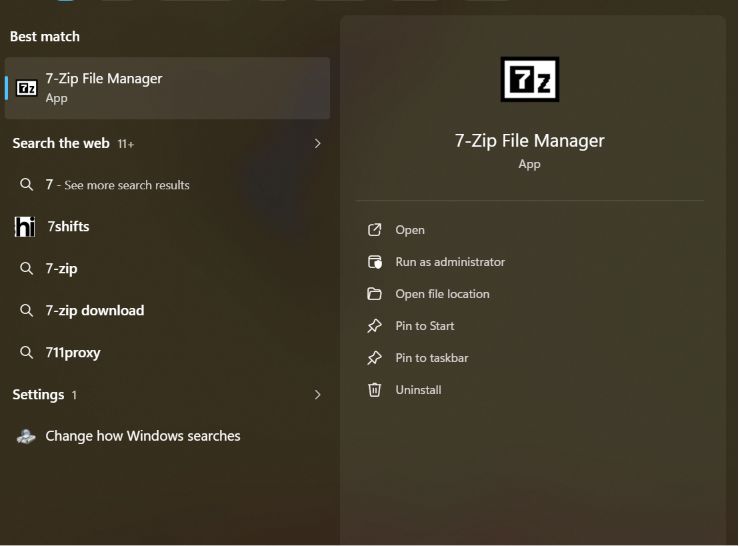
*Figure 1: 7-Zip File Manager successfully installed on the host machine.*

### Step 2: Using my Existing Virtual Machine Box

I used my existing Oracle VirtualBox installation (already set up with prior VMs from previous labs) as the hypervisor for this task, rather than installing VirtualBox again.

### Step 3: Create the NAT Network

Inside VirtualBox's **Network Manager**, a new NAT Network named `NatNetwork` was created with the following settings:
- **IPv4 Prefix:** `10.0.0.0/24`
- **Enable DHCP:** Checked
- **Enable IPv6:** Unchecked (disabled)

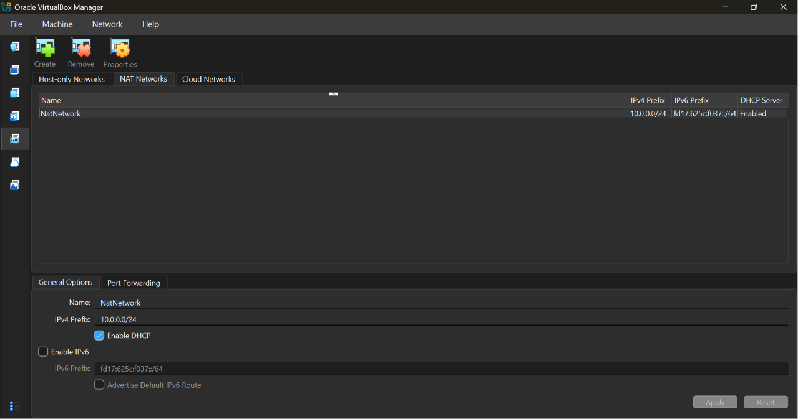
*Figure 2: NAT Network "NatNetwork" created with IPv4 Prefix 10.0.0.0/24, DHCP enabled, and IPv6 disabled.*

### Step 4: Import Kali Linux

Kali Linux 2026.2 was downloaded from the official source ([kali.org/get-kali](https://kali.org/get-kali)) as a compressed VirtualBox image, then extracted using 7-Zip. The extracted `.vbox`/`.vdi` files were opened directly in VirtualBox, which imported the VM successfully. Once started, the machine appeared in the VirtualBox Manager with a **Running** status.

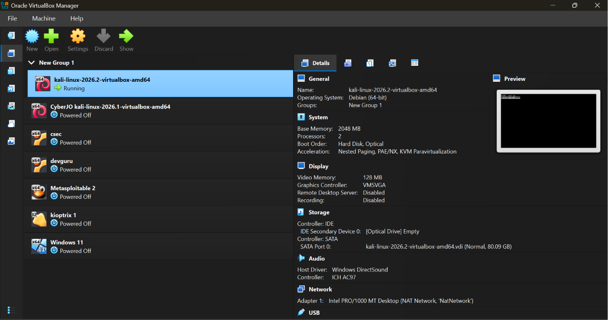
*Figure 3: Kali Linux 2026.2 VM imported and running, showing Base Memory (2048 MB) and Network Adapter 1 attached to NatNetwork.*

### Step 5: Configure the Kali Linux Network

Before starting the VM, the network adapter settings were configured:
- **Adapter 1:** Attached to `NAT Network` → `NatNetwork`
- **Adapter Type:** Intel PRO/1000 MT Desktop (82540EM)
- **Promiscuous Mode:** Allow All
- **Base Memory:** 2048 MB (left unchanged)
- **Virtual Monitor:** 1 (left unchanged)

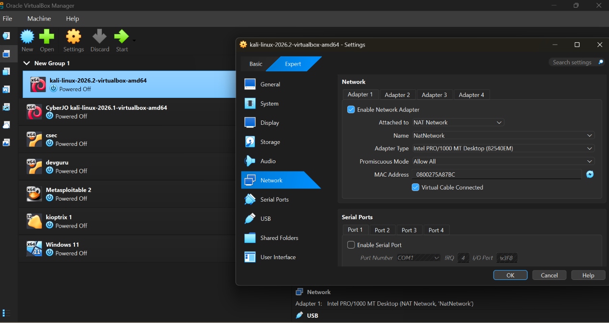
*Figure 4: Kali VM network adapter configured — NAT Network, Intel PRO/1000 MT Desktop adapter, Promiscuous Mode set to Allow All.*

The VM was then started, and the status changed to **Running**. On first boot, the Kali Linux desktop appeared successfully.

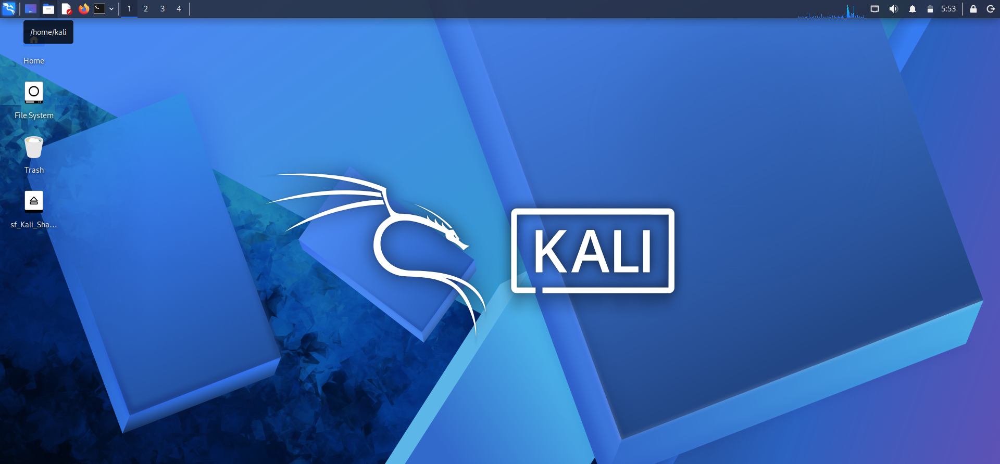
*Figure 5: Kali Linux desktop environment on first appearance after boot.*

With the desktop loaded, the **Wired Connection** was edited manually under **IPv4 Settings**:
- **Method:** Manual
- **Address:** 10.0.0.2
- **Netmask:** 24
- **Gateway:** 10.0.0.1
- **DNS servers:** 8.8.8.8

The settings were then saved.

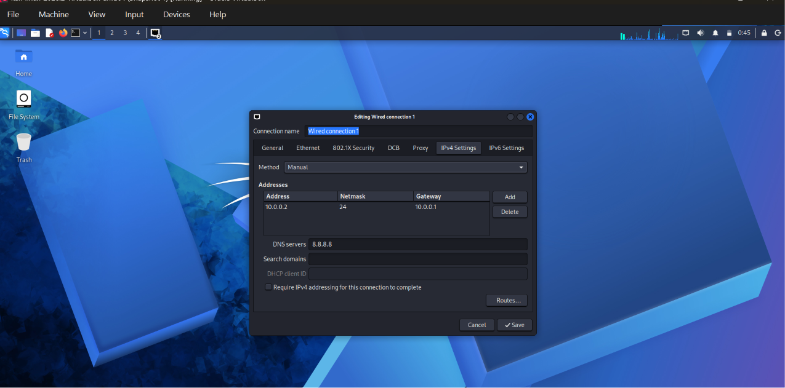
*Figure 6: Manual static IPv4 configuration applied to the Kali wired connection.*

### Step 6: Create a Clean VM Snapshot

After confirming the network was configured and working correctly (see Lab Verification below), a clean snapshot of the VM was taken. This baseline snapshot preserves the working state of the machine so it can be restored if future tasks require a fresh starting point, without having to repeat the full setup process.

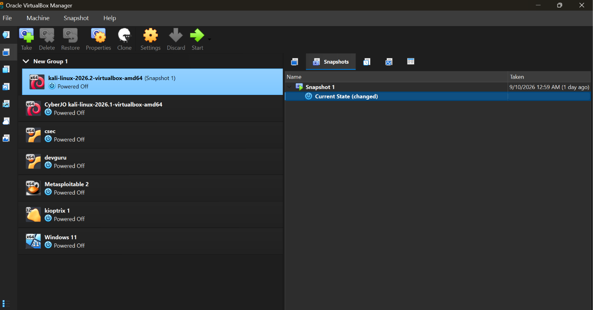
*Figure 12: "Snapshot 1" captured in VirtualBox, preserving the clean, working state of the Kali Linux VM for future tasks.*

---

## Lab Verification

After saving the static IP configuration, the network briefly disconnected. This was resolved using terminal commands (see *Problems Encountered and Solutions* below).

Once connectivity was restored, `ifconfig` was run to confirm the assigned static IP was active on the `eth0` interface:

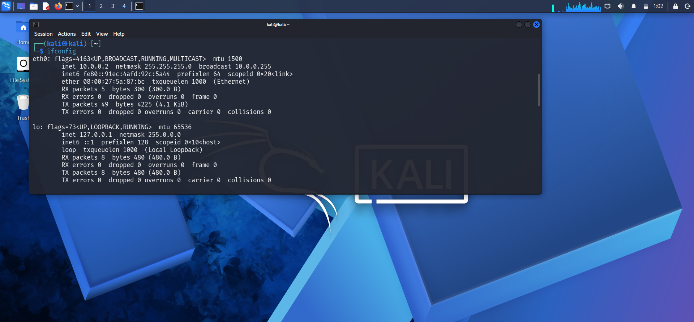
*Figure 7: `ifconfig` confirms `eth0` is up with IP address 10.0.0.2/24, matching the configured static address.*

Internet connectivity was then verified in two ways:

**1. Ping test to google.com** — after resolving an initial packet loss issue (detailed below), a clean ping test returned 0% packet loss:

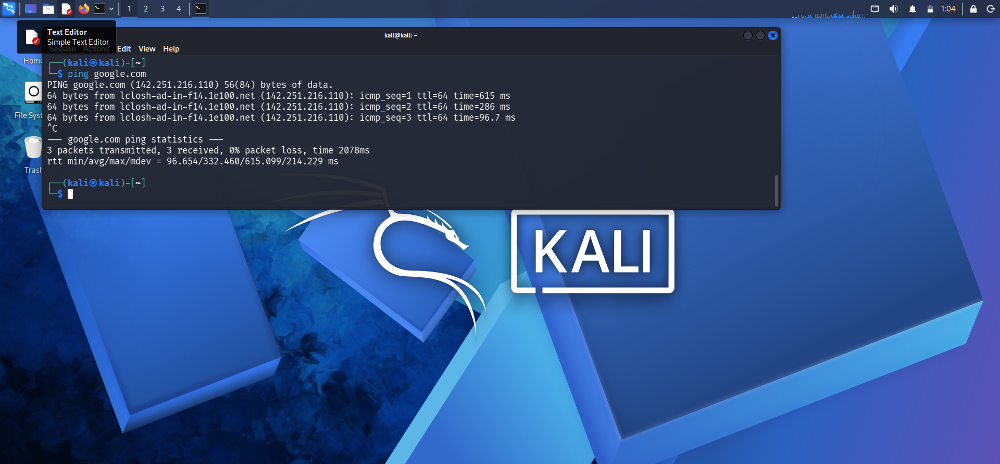
*Figure 8: Successful ping to google.com — 3 packets transmitted, 3 received, 0% packet loss.*

**2. Browser test** — GitHub was accessed successfully via the Firefox browser inside the Kali VM, confirming full internet connectivity through the NAT Network.

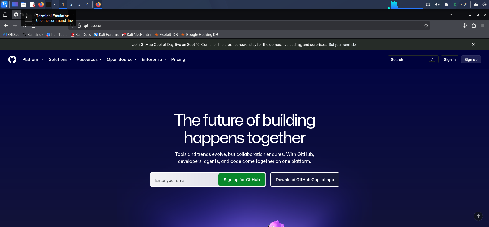
*Figure 11: This documentation is published to GitHub as part of the Network Walks internship repository.*

---

## Problems Encountered and Solutions

| # | Problem | Cause | Solution |
|---|---|---|---|
| 1 | Network disconnected immediately after saving the manual wired connection settings | The interface needed to be reset for the new static IP configuration to take effect | Ran the following commands (from the lab material) to reset and re-activate the connection: |

```bash
sudo nmcli connection modify "Wired connection 1" ipv4.dad-timeout 0
sudo nmcli connection down Wired\ connection\ 1
sudo nmcli connection up Wired\ connection\ 1
```

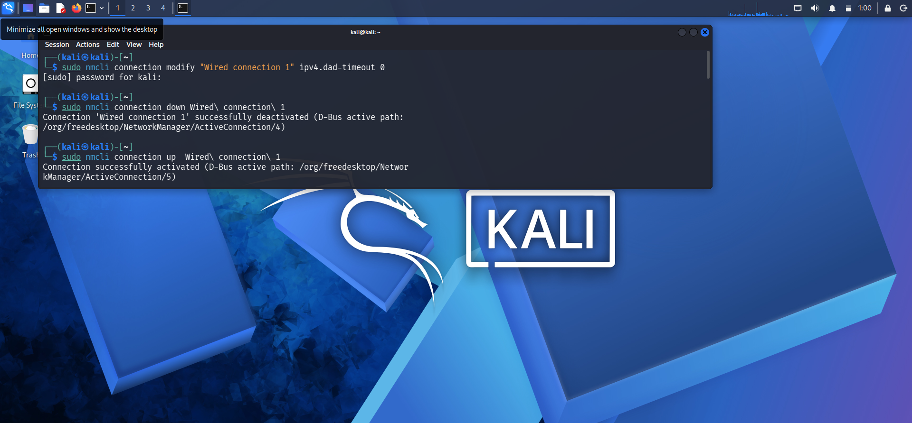
*Figure 9: Commands used to fix the disconnected wired connection — the connection was successfully reactivated.*

After running these commands, the connection was successfully reactivated, and `ifconfig` confirmed the IP was correctly bound to `eth0`.

| # | Problem | Cause | Solution |
|---|---|---|---|
| 2 | Ping to google.com showed 16.6667% packet loss (6 packets transmitted, 5 received) | Suspected intermittent issue with the home router | Restarted the router, then re-ran the ping test |

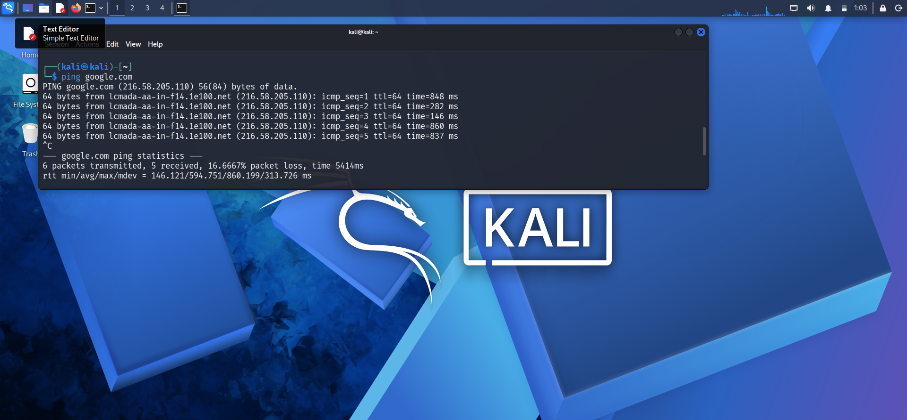
*Figure 10: Initial ping test showing 16.6667% packet loss (6 transmitted, 5 received).*

After restarting the router, the ping test was repeated and returned a clean result — 3 packets transmitted, 3 received, 0% packet loss (see Figure 8 above), confirming the issue was resolved at the router level rather than within the Kali VM or NAT Network configuration.

---

## What I Learned

- How to configure an isolated **NAT Network** in VirtualBox, including subnet, DHCP, and IPv6 settings, to support a self-contained lab environment.
- How to properly configure a VM's network adapter (adapter type and promiscuous mode) for lab/testing purposes.
- How to manually assign a static IP address, netmask, gateway, and DNS server to a Linux system via the NetworkManager GUI.
- How to use `nmcli` commands to troubleshoot and recover a dropped network connection after changing IP settings.
- How to verify network connectivity at multiple levels — interface configuration (`ifconfig`), Layer 3 reachability (`ping`), and application-level access (web browser).
- The importance of methodical troubleshooting: isolating whether a connectivity issue originates from the VM, the virtual network, or external infrastructure (e.g., the router).
- The value of taking a clean snapshot once a lab environment is verified working, to save time on future tasks.

## Security and Ethical Use

This lab environment was built strictly for **educational and authorized practice purposes** as part of a supervised cybersecurity internship program. It is fully isolated using a VirtualBox NAT Network and does not expose any host or production systems to risk. Promiscuous Mode was enabled solely to support future authorized packet-capture and network-analysis exercises within this isolated lab, not for use against any real-world network I do not own or have explicit permission to test. All activity performed on this VM will remain confined to this internal lab environment and will follow the principles of responsible, ethical, and authorized security testing at all times.

---

## Tools & Resources

- **7-Zip:** https://7-zip.org/download.html
- **Kali Linux:** https://kali.org/get-kali
- **Oracle VirtualBox** (hypervisor)
- **GitHub** (documentation/repository hosting)

---

## Author

**Akintayo Akinjolie (CyberJO)**

Aspiring GRC Analyst

LinkedIn: [www.linkedin.com/in/rtn-akintayo-akinjolie-548751111](https://www.linkedin.com/in/rtn-akintayo-akinjolie-548751111)

## Project Information

- **Program Name:** Cybersecurity at Network Walks
- **Week:** 1
- **Task:** 1 - Cybersecurity Lab Setup on VMBox
- **Repository:** GitHub
